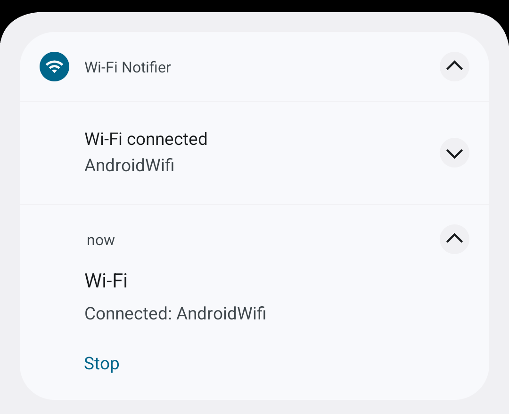

# Wi-Fi Notifier

An Android app that does exactly one thing: it tells you the name of the Wi-Fi
network your phone has just connected to. There is no screen at all — the app
lives in the notification shade.



## What it does

Two notifications, two different reasons to exist:

| Notification | Channel | What it shows |
| --- | --- | --- |
| **Current network** | `Current network`, silent | The network the phone is on right now, updated on every change, with a `Stop` action that shuts the watcher down |
| **Wi-Fi connected** | `Wi-Fi connections`, alerting | Posted the moment the phone joins a network, with the network name as its text |

The watcher survives the app being swiped away: it runs as a foreground service,
so the ongoing notification is always there — and that is also the only way to
keep a background process alive on modern Android.

Reconnecting to the same network after a disconnect alerts again; the very first
launch after a restart does not, so a system-initiated process restart does not
spam you.

## Permissions

| Permission | Why |
| --- | --- |
| `NEARBY_WIFI_DEVICES` | The Android 13+ permission for Wi-Fi APIs. Declared **without** `neverForLocation`: with that flag the system replaces the SSID with `<unknown ssid>` |
| `ACCESS_FINE_LOCATION` | In practice the SSID of the connected network is only handed out with location granted, on Google's own builds as well as on OEM firmware. Location services must be enabled on the device |
| `POST_NOTIFICATIONS` | Shows the two notifications |
| `FOREGROUND_SERVICE` + `FOREGROUND_SERVICE_LOCATION` | The watcher itself. The service is typed `location` on purpose, see below |

All of them are asked for once, on the first launch, by an activity that has no
UI and closes itself as soon as the request is answered.

## How it works

```
launcher --> MainActivity (no UI, translucent theme)
                |  asks for the permissions, starts the service, finishes
                v
            WifiWatchService (foreground, type location)
                |  NetworkCallback for TRANSPORT_WIFI  -- events
                |  20 s poll                            -- safety net
                v
             WifiSsid.current(context)  --> "Connected: <name>" | "Not connected"
```

Three things about that picture are load-bearing, and all three were found the
hard way (see `AGENTS.md` for the details):

- the service must be typed **`location`**, otherwise the system stops treating
  the app as a foreground one the moment the activity closes and starts hiding
  the SSID again;
- the ongoing notification is updated by calling `startForeground` again, not
  `NotificationManager.notify` — the latter does not update a notification owned
  by a foreground service;
- the network name is looked up in three places, because the active network is
  not always Wi-Fi: a phone can sit on Ethernet or mobile data with Wi-Fi joined
  alongside it, and emulators report their virtual Wi-Fi exactly that way.

## Requirements

- Android 13 (API 33) or newer on the device.
- JDK 17 and the Android SDK with platform 36 to build.
- Android Gradle Plugin 9.4.1 and Gradle 9.6.0 (fetched by the wrapper). Kotlin
  support comes built into AGP 9, so there is no separate Kotlin plugin and no
  third-party library in the app at all.

## Building

```sh
./gradlew assembleDebug      # app/build/outputs/apk/debug/app-debug.apk
./gradlew assembleRelease    # app/build/outputs/apk/release/app-release-unsigned.apk
```

The release APK is unsigned: add a `signingConfig` to `app/build.gradle.kts` or
sign it with `apksigner`. `local.properties` must point at the SDK
(`sdk.dir=/path/to/Android/Sdk`), or `ANDROID_HOME` has to be set.

## Installing

```sh
adb install -r app/build/outputs/apk/debug/app-debug.apk
```

Then tap the launcher icon and allow the three permission prompts. The ongoing
notification appears immediately and already shows the current network.

## Project layout

```
app/src/main/
├── AndroidManifest.xml                 permissions, the service and its FGS type
├── java/com/buran/wifinotifier/
│   ├── MainActivity.kt                 asks for the permissions, starts the service
│   ├── WifiWatchService.kt             the watcher and both notifications
│   └── WifiSsid.kt                     the only place that reads the SSID
└── res/
    ├── values/strings.xml              all user-facing text (English)
    ├── drawable/ic_stat_wifi.xml       notification icon
    └── mipmap-anydpi-v26/              adaptive launcher icon
docs/notifications.png                  the screenshot above
```

## Limitations

- The app is started by tapping its icon. It does not come back after a reboot:
  there is no `BOOT_COMPLETED` receiver, so it has to be started again (or a
  receiver has to be added).
- It reports the network the phone is joined to; it does not list the networks
  around you and it never asks for a scan.
- Google Play treats a `location` foreground service as a declaration-worthy
  one. That is fine for a personal build, but publishing the app there would
  need that declaration and a review. The `specialUse` fallback keeps the app
  working while its screen is open when the location type cannot be started.
- Verified on an Android 14 emulator (API 34) and on the emulator's
  `AndroidWifi` network; no physical device testing yet.

## License

MIT — see [LICENSE](LICENSE).
